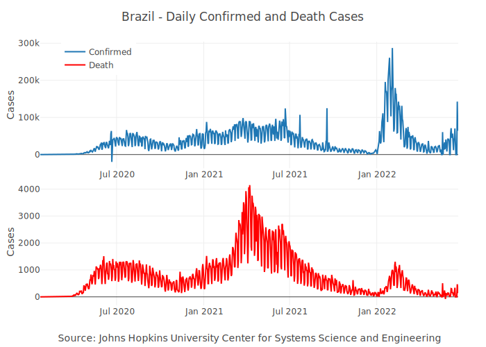
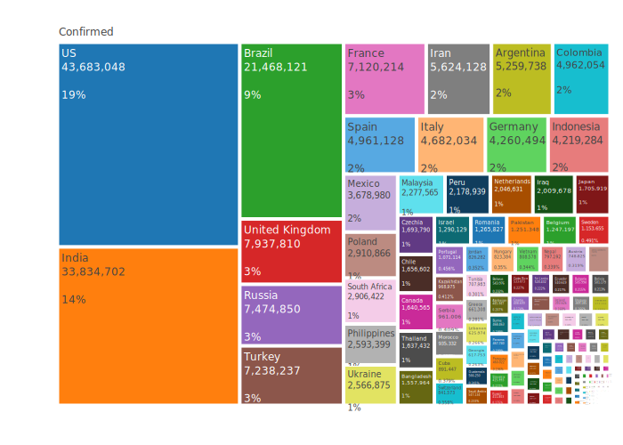
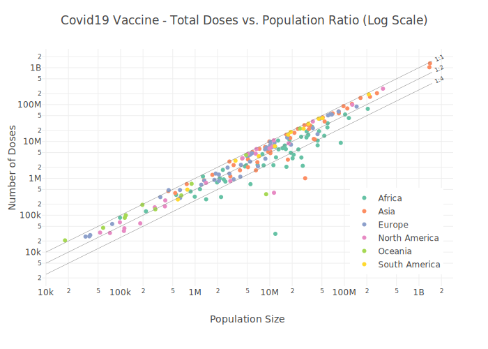
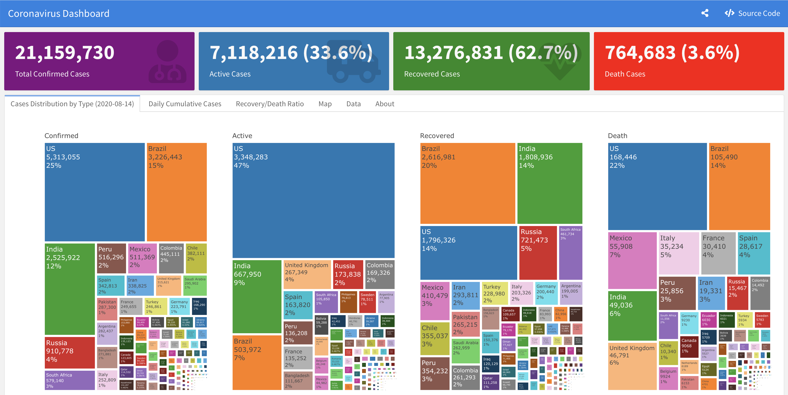

<!-- README.md is generated from README.Rmd. Please edit that file -->

# coronavirus <a href='https://RamiKrispin.github.io/coronavirus/'></a>

<!-- badges: start --->

[](https://github.com/RamiKrispin/coronavirus/actions/workflows/main.yml)
[](https://github.com/RamiKrispin/coronavirus/actions/workflows/data_refresh.yml)
[](https://cran.r-project.org/package=coronavirus)
[](https://lifecycle.r-lib.org/articles/stages.html#maturing)
[](https://opensource.org/licenses/MIT)
[](https://github.com/RamiKrispin/coronavirus/commit/master)
[](https://cran.r-project.org/package=coronavirus)

<!-- badges: end -->

The coronavirus package provides a tidy format dataset of the 2019 Novel
Coronavirus COVID-19 (2019-nCoV) epidemic and the vaccination efforts by
country. The raw data is being pulled from the Johns Hopkins University
Center for Systems Science and Engineering (JHU CCSE) Coronavirus
[repository](https://github.com/CSSEGISandData/COVID-19).

More details available
[here](https://RamiKrispin.github.io/coronavirus/), and a `csv` format
of the package dataset available
[here](https://github.com/RamiKrispin/coronavirus/tree/master/csv)

</a>

<figcaption>
Source: Centers for Disease Control and Prevention’s Public Health Image
Library
</figcaption>

## Important Notes

-   As this an ongoing situation, frequent changes in the data format
    may occur, please visit the package
    [changelog](https://ramikrispin.github.io/coronavirus/news/index.html)
    (e.g., News) and/or see pinned
    [issues](https://github.com/RamiKrispin/coronavirus/issues) to get
    updates about those changes
-   As of Auguest 4th JHU CCSE stopped track recovery cases, please see
    this [issue](https://github.com/RamiKrispin/coronavirus/issues/71)
    for more details
-   Negative values and/or anomalies may occurred in the data for the
    following reasons:
    -   The calculation of the daily cases from the raw data which is in
        cumulative format is done by taking the daily difference. In
        some cases, some retro updates not tie to the day that they
        actually occurred such as removing false positive cases
    -   Anomalies or error in the raw data
    -   Please see this
        [issue](https://github.com/RamiKrispin/coronavirus/issues/55)
        for more details

## Vignettes

Additional documentation available on the followng vignettes:

-   [Introduction to the Coronavirus
    Dataset](https://ramikrispin.github.io/coronavirus/articles/intro_coronavirus_dataset.html)
-   [Covid19R Project Data
    Format](https://ramikrispin.github.io/coronavirus/articles/covid19R.html)
-   [Update the coronavirus
    Dataset](https://ramikrispin.github.io/coronavirus/articles/update_dataset_function.html)
-   [Covid19 Vaccine
    Data](https://ramikrispin.github.io/coronavirus/articles/covid19_vaccine.html)
-   [Geospatial
    Visualization](https://ramikrispin.github.io/coronavirus/articles/geospatial_visualization.html)

## Installation

Install the CRAN version:

``` r
install.packages("coronavirus")
```

Install the Github version (refreshed on a daily bases):

``` r
# install.packages("devtools")
devtools::install_github("RamiKrispin/coronavirus")
```

## Datasets

The package provides the following two datasets:

-   **coronavirus** - tidy (long) format of the JHU CCSE
    [datasets](https://github.com/CSSEGISandData/COVID-19/tree/master/csse_covid_19_data/csse_covid_19_time_series).
    That includes the following columns:

    -   `date` - The date of the observation, using `Date` class
    -   `province` - Name of province/state, for countries where data is
        provided split across multiple provinces/states
    -   `country` - Name of country/region
    -   `lat` - The latitude code
    -   `long` - The longitude code
    -   `type` - An indicator for the type of cases (confirmed, death,
        recovered)
    -   `cases` - Number of cases on given date
    -   `uid` - Country code
    -   `province_state` - Province or state if applicable
    -   `iso2` - Officially assigned country code identifiers with
        two-letter
    -   `iso3` - Officially assigned country code identifiers with
        three-letter
    -   `code3` - UN country code
    -   `fips` - Federal Information Processing Standards code that
        uniquely identifies counties within the USA
    -   `combined_key` - Country and province (if applicable)
    -   `population` - Country or province population
    -   `continent_name` - Continent name
    -   `continent_code` - Continent code

-   **covid19_vaccine** - a tidy (long) format of the the Johns Hopkins
    [Centers for Civic Impact](https://govex.jhu.edu/) global
    vaccination
    [dataset](https://github.com/govex/COVID-19/tree/master/data_tables/vaccine_data)
    by country. This dataset includes the following columns:

    -   `country_region` - Country or region name
    -   `date` - Data collection date in YYYY-MM-DD format
    -   `doses_admin` - Cumulative number of doses administered. When a
        vaccine requires multiple doses, each one is counted
        independently
    -   `people_partially_vaccinated` - Cumulative number of people who
        received at least one vaccine dose. When the person receives a
        prescribed second dose, it is not counted twice
    -   `people_fully_vaccinated` - Cumulative number of people who
        received all prescribed doses necessary to be considered fully
        vaccinated
    -   `report_date_string` - Data report date in YYYY-MM-DD format
    -   `uid` - Country code
    -   `province_state` - Province or state if applicable
    -   `iso2` - Officially assigned country code identifiers with
        two-letter
    -   `iso3` - Officially assigned country code identifiers with
        three-letter
    -   `code3` - UN country code
    -   `fips` - Federal Information Processing Standards code that
        uniquely identifies counties within the USA
    -   `lat` - Latitude
    -   `long` - Longitude
    -   `combined_key` - Country and province (if applicable)
    -   `population` - Country or province population
    -   `continent_name` - Continent name
    -   `continent_code` - Continent code

## Data refresh

While the **coronavirus** [CRAN
version](https://cran.r-project.org/package=coronavirus) is updated
every month or two, the [Github (Dev)
version](https://github.com/RamiKrispin/coronavirus) is updated on a
daily bases. The `update_dataset` function enables to overcome this gap
and keep the installed version with the most recent data available on
the Github version:

``` r
library(coronavirus)
update_dataset()
```

**Note:** must restart the R session to have the updates available

Alternatively, you can pull the data using the
[Covid19R](https://covid19r.github.io/documentation/) project [data
standard
format](https://covid19r.github.io/documentation/data-format-standard.html)
with the `refresh_coronavirus_jhu` function:

``` r
covid19_df <- refresh_coronavirus_jhu()
#> Loading 2020 data
#> Loading 2021 data
#> Loading 2022 data
#> Loading 2023 data
head(covid19_df)
#>         date    location location_type location_code location_code_type
#> 1 2022-08-01 Afghanistan       country            AF         iso_3166_2
#> 2 2020-03-15 Afghanistan       country            AF         iso_3166_2
#> 3 2022-08-02 Afghanistan       country            AF         iso_3166_2
#> 4 2021-07-12 Afghanistan       country            AF         iso_3166_2
#> 5 2020-03-16 Afghanistan       country            AF         iso_3166_2
#> 6 2021-07-11 Afghanistan       country            AF         iso_3166_2
#>       data_type value      lat     long
#> 1 recovered_new     0 33.93911 67.70995
#> 2 recovered_new     0 33.93911 67.70995
#> 3 recovered_new     0 33.93911 67.70995
#> 4     cases_new  1075 33.93911 67.70995
#> 5 recovered_new     1 33.93911 67.70995
#> 6     cases_new   801 33.93911 67.70995
```

## Usage

``` r
data("coronavirus")

head(coronavirus)
#>         date province country     lat      long      type cases   uid iso2 iso3
#> 1 2020-01-22  Alberta  Canada 53.9333 -116.5765 confirmed     0 12401   CA  CAN
#> 2 2020-01-23  Alberta  Canada 53.9333 -116.5765 confirmed     0 12401   CA  CAN
#> 3 2020-01-24  Alberta  Canada 53.9333 -116.5765 confirmed     0 12401   CA  CAN
#> 4 2020-01-25  Alberta  Canada 53.9333 -116.5765 confirmed     0 12401   CA  CAN
#> 5 2020-01-26  Alberta  Canada 53.9333 -116.5765 confirmed     0 12401   CA  CAN
#> 6 2020-01-27  Alberta  Canada 53.9333 -116.5765 confirmed     0 12401   CA  CAN
#>   code3    combined_key population continent_name continent_code
#> 1   124 Alberta, Canada    4413146  North America             NA
#> 2   124 Alberta, Canada    4413146  North America             NA
#> 3   124 Alberta, Canada    4413146  North America             NA
#> 4   124 Alberta, Canada    4413146  North America             NA
#> 5   124 Alberta, Canada    4413146  North America             NA
#> 6   124 Alberta, Canada    4413146  North America             NA
```

Summary of the total confrimed cases by country (top 20):

``` r
library(dplyr)

summary_df <- coronavirus %>% 
  filter(type == "confirmed") %>%
  group_by(country) %>%
  summarise(total_cases = sum(cases)) %>%
  arrange(-total_cases)

summary_df %>% head(20) 
#> # A tibble: 20 × 2
#>    country        total_cases
#>    <chr>                <dbl>
#>  1 US               102830381
#>  2 India             44685087
#>  3 France            39760676
#>  4 Germany           37893892
#>  5 Brazil            36905201
#>  6 Japan             32901767
#>  7 Korea, South      30325483
#>  8 Italy             25488166
#>  9 United Kingdom    24549097
#> 10 Russia            21725309
#> 11 Turkey            17042722
#> 12 Spain             13740531
#> 13 Vietnam           11526627
#> 14 Australia         11327900
#> 15 Argentina         10040329
#> 16 Taiwan*            9754006
#> 17 Netherlands        8697711
#> 18 Iran               7565253
#> 19 Mexico             7400848
#> 20 Indonesia          6732179
```

Summary of new cases during the past 24 hours by country and type (as of
2023-02-09):

``` r
library(tidyr)

coronavirus %>% 
  filter(date == max(date)) %>%
  select(country, type, cases) %>%
  group_by(country, type) %>%
  summarise(total_cases = sum(cases)) %>%
  pivot_wider(names_from = type,
              values_from = total_cases) %>%
  arrange(-confirmed)
#> # A tibble: 201 × 4
#> # Groups:   country [201]
#>    country        confirmed death recovery
#>    <chr>              <dbl> <dbl>    <dbl>
#>  1 US                 79947   942        0
#>  2 Japan              32969   223        0
#>  3 United Kingdom     22231  -334        0
#>  4 Taiwan*            20912    45        0
#>  5 Australia          14996   235        0
#>  6 Germany            14178   134        0
#>  7 Korea, South       13504    17        0
#>  8 Russia             12208    40        0
#>  9 Mexico              9946    97        0
#> 10 Brazil              7518    37        0
#> # … with 191 more rows
```

Plotting daily confirmed and death cases in Brazil:

``` r
library(plotly)

coronavirus %>% 
  group_by(type, date) %>%
  summarise(total_cases = sum(cases)) %>%
  pivot_wider(names_from = type, values_from = total_cases) %>%
  arrange(date) %>%
  mutate(active = confirmed - death - recovery) %>%
  mutate(active_total = cumsum(active),
                recovered_total = cumsum(recovery),
                death_total = cumsum(death)) %>%
  plot_ly(x = ~ date,
                  y = ~ active_total,
                  name = 'Active', 
                  fillcolor = '#1f77b4',
                  type = 'scatter',
                  mode = 'none', 
                  stackgroup = 'one') %>%
  add_trace(y = ~ death_total, 
             name = "Death",
             fillcolor = '#E41317') %>%
  add_trace(y = ~recovered_total, 
            name = 'Recovered', 
            fillcolor = 'forestgreen') %>%
  layout(title = "Distribution of Covid19 Cases Worldwide",
         legend = list(x = 0.1, y = 0.9),
         yaxis = list(title = "Number of Cases"),
         xaxis = list(title = "Source: Johns Hopkins University Center for Systems Science and Engineering"))
```



Plot the confirmed cases distribution by counrty with treemap plot:

``` r
conf_df <- coronavirus %>% 
  filter(type == "confirmed") %>%
  group_by(country) %>%
  summarise(total_cases = sum(cases)) %>%
  arrange(-total_cases) %>%
  mutate(parents = "Confirmed") %>%
  ungroup() 
  
  plot_ly(data = conf_df,
          type= "treemap",
          values = ~total_cases,
          labels= ~ country,
          parents=  ~parents,
          domain = list(column=0),
          name = "Confirmed",
          textinfo="label+value+percent parent")
```



``` r
data(covid19_vaccine)

head(covid19_vaccine)
#>         date country_region continent_name continent_code combined_key
#> 1 2020-12-29        Austria         Europe             EU      Austria
#> 2 2020-12-29        Bahrain           Asia             AS      Bahrain
#> 3 2020-12-29        Belarus         Europe             EU      Belarus
#> 4 2020-12-29        Belgium         Europe             EU      Belgium
#> 5 2020-12-29         Canada  North America             NA       Canada
#> 6 2020-12-29          Chile  South America             SA        Chile
#>   doses_admin people_at_least_one_dose population uid iso2 iso3 code3 fips
#> 1        2123                     2123    9006400  40   AT  AUT    40 <NA>
#> 2       55014                    55014    1701583  48   BH  BHR    48 <NA>
#> 3           0                        0    9449321 112   BY  BLR   112 <NA>
#> 4         340                      340   11589616  56   BE  BEL    56 <NA>
#> 5       59079                    59078   37855702 124   CA  CAN   124 <NA>
#> 6          NA                       NA   19116209 152   CL  CHL   152 <NA>
#>        lat       long
#> 1  47.5162  14.550100
#> 2  26.0275  50.550000
#> 3  53.7098  27.953400
#> 4  50.8333   4.469936
#> 5  60.0000 -95.000000
#> 6 -35.6751 -71.543000
```

Taking a snapshot of the data from the most recent date available and
calculate the ratio between total doses admin and the population size:

``` r
df_summary <- covid19_vaccine |>
  filter(date == max(date)) |>
  select(date, country_region, doses_admin, total = people_at_least_one_dose, population, continent_name) |>
  mutate(doses_pop_ratio = doses_admin / population,
         total_pop_ratio = total / population) |>
  filter(country_region != "World", 
         !is.na(population),
         !is.na(total)) |>
  arrange(- total)

head(df_summary, 10)
#>          date country_region doses_admin      total population continent_name
#> 1  2023-02-10          China          NA 1310267000 1404676330           Asia
#> 2  2023-02-10          India          NA 1027356828 1380004385           Asia
#> 3  2023-02-10             US   670306507  269208743  329466283  North America
#> 4  2023-02-10      Indonesia   444303130  203657535  273523621           Asia
#> 5  2023-02-10         Brazil   500646783  189097459  212559409  South America
#> 6  2023-02-10       Pakistan   333085477  162206190  220892331           Asia
#> 7  2023-02-10     Bangladesh   353318909  151054434  164689383           Asia
#> 8  2023-02-10          Japan   380451598  104642871  126476458           Asia
#> 9  2023-02-10         Mexico   225063079   99071001  127792286  North America
#> 10 2023-02-10        Vietnam   265668329   90454197   97338583           Asia
#>    doses_pop_ratio total_pop_ratio
#> 1               NA       0.9327893
#> 2               NA       0.7444591
#> 3         2.034522       0.8171056
#> 4         1.624368       0.7445702
#> 5         2.355326       0.8896217
#> 6         1.507909       0.7343224
#> 7         2.145365       0.9172081
#> 8         3.008082       0.8273703
#> 9         1.761163       0.7752502
#> 10        2.729322       0.9292738
```

Plot of the total doses and population ratio by country:

``` r
# Setting the diagonal lines range
line_start <- 10000
line_end <- 1500 * 10 ^ 6

# Filter the data
d <- df_summary |> 
  filter(country_region != "World", 
         !is.na(population),
         !is.na(total)) 


# Replot it
p3 <- plot_ly() |>
  add_markers(x = d$population,
              y = d$total,
              text = ~ paste("Country: ", d$country_region, "<br>",
                             "Population: ", d$population, "<br>",
                             "Total Doses: ", d$total, "<br>",
                             "Ratio: ", round(d$total_pop_ratio, 2), 
                             sep = ""),
              color = d$continent_name,
              type = "scatter",
              mode = "markers") |>
  add_lines(x = c(line_start, line_end),
            y = c(line_start, line_end),
            showlegend = FALSE,
            line = list(color = "gray", width = 0.5)) |>
  add_lines(x = c(line_start, line_end),
            y = c(0.5 * line_start, 0.5 * line_end),
            showlegend = FALSE,
            line = list(color = "gray", width = 0.5)) |>
  
  add_lines(x = c(line_start, line_end),
            y = c(0.25 * line_start, 0.25 * line_end),
            showlegend = FALSE,
            line = list(color = "gray", width = 0.5)) |>
  add_annotations(text = "1:1",
                  x = log10(line_end * 1.25),
                  y = log10(line_end * 1.25),
                  showarrow = FALSE,
                  textangle = -25,
                  font = list(size = 8),
                  xref = "x",
                  yref = "y") |>
  add_annotations(text = "1:2",
                  x = log10(line_end * 1.25),
                  y = log10(0.5 * line_end * 1.25),
                  showarrow = FALSE,
                  textangle = -25,
                  font = list(size = 8),
                  xref = "x",
                  yref = "y") |>
  add_annotations(text = "1:4",
                  x = log10(line_end * 1.25),
                  y = log10(0.25 * line_end * 1.25),
                  showarrow = FALSE,
                  textangle = -25,
                  font = list(size = 8),
                  xref = "x",
                  yref = "y") |>
  add_annotations(text = "Source: Johns Hopkins University - Centers for Civic Impact",
                  showarrow = FALSE,
                  xref = "paper",
                  yref = "paper",
                  x = -0.05, y = - 0.33) |>
  layout(title = "Covid19 Vaccine - Total Doses vs. Population Ratio (Log Scale)",
         margin = list(l = 50, r = 50, b = 90, t = 70),
         yaxis = list(title = "Number of Doses",
                      type = "log"),
         xaxis = list(title = "Population Size",
                      type = "log"),
         legend = list(x = 0.75, y = 0.05))

```



## Dashboard

**Note:** Currently, the dashboard is under maintenance due to recent
changes in the data structure. Please see this
[issue](https://github.com/RamiKrispin/coronavirus_dashboard/issues/25)

A supporting dashboard is available
[here](https://ramikrispin.github.io/coronavirus_dashboard/)

[](https://ramikrispin.github.io/coronavirus_dashboard/)

## Data Sources

The raw data pulled and arranged by the Johns Hopkins University Center
for Systems Science and Engineering (JHU CCSE) from the following
resources:

-   World Health Organization (WHO): <https://www.who.int/> <br>
-   DXY.cn. Pneumonia. 2020.
    <https://ncov.dxy.cn/ncovh5/view/pneumonia>. <br>
-   BNO News:
    <https://bnonews.com/index.php/2020/04/the-latest-coronavirus-cases/>
    <br>
-   National Health Commission of the People’s Republic of China (NHC):
    <br> http:://www.nhc.gov.cn/xcs/yqtb/list_gzbd.shtml <br>
-   China CDC (CCDC):
    http:://weekly.chinacdc.cn/news/TrackingtheEpidemic.htm <br>
-   Hong Kong Department of Health:
    <https://www.chp.gov.hk/en/features/102465.html> <br>
-   Macau Government: <https://www.ssm.gov.mo/portal/> <br>
-   Taiwan CDC:
    <https://sites.google.com/cdc.gov.tw/2019ncov/taiwan?authuser=0>
    <br>
-   US CDC: <https://www.cdc.gov/coronavirus/2019-ncov/index.html> <br>
-   Government of Canada:
    <https://www.canada.ca/en/public-health/services/diseases/2019-novel-coronavirus-infection/symptoms.html>
    <br>
-   Australia Government Department of
    Health:<https://www.health.gov.au/health-alerts/covid-19> <br>
-   European Centre for Disease Prevention and Control (ECDC):
    <https://www.ecdc.europa.eu/en/covid-19/country-overviews>
-   Ministry of Health Singapore (MOH):
    <https://www.moh.gov.sg/covid-19>
-   Italy Ministry of Health:
    <https://www.salute.gov.it/nuovocoronavirus>
-   1Point3Arces: <https://coronavirus.1point3acres.com/en>
-   WorldoMeters: <https://www.worldometers.info/coronavirus/>
-   COVID Tracking Project: <https://covidtracking.com/data/>. (US
    Testing and Hospitalization Data. We use the maximum reported value
    from “Currently” and “Cumulative” Hospitalized for our
    hospitalization number reported for each state.)
-   French Government: <https://dashboard.covid19.data.gouv.fr/>
-   COVID Live (Australia): <https://covidlive.com.au/>
-   Washington State Department of
    Health:<https://doh.wa.gov/emergencies/covid-19>
-   Maryland Department of Health: <https://coronavirus.maryland.gov/>
-   New York State Department of Health:
    <https://health.data.ny.gov/Health/New-York-State-Statewide-COVID-19-Testing/xdss-u53e/data>
-   NYC Department of Health and Mental Hygiene:
    <https://www.nyc.gov/site/doh/covid/covid-19-data.page> and
    <https://github.com/nychealth/coronavirus-data>
-   Florida Department of Health Dashboard:
    <https://services1.arcgis.com/CY1LXxl9zlJeBuRZ/arcgis/rest/services/Florida_COVID19_Cases/FeatureServer/0>
    and
    <https://fdoh.maps.arcgis.com/apps/dashboards/index.html#/8d0de33f260d444c852a615dc7837c86>
-   Palestine (West Bank and Gaza): <https://corona.ps/details>
-   Israel:
    <https://govextra.gov.il/ministry-of-health/corona/corona-virus/>
-   Colorado: <https://covid19.colorado.gov/data>
