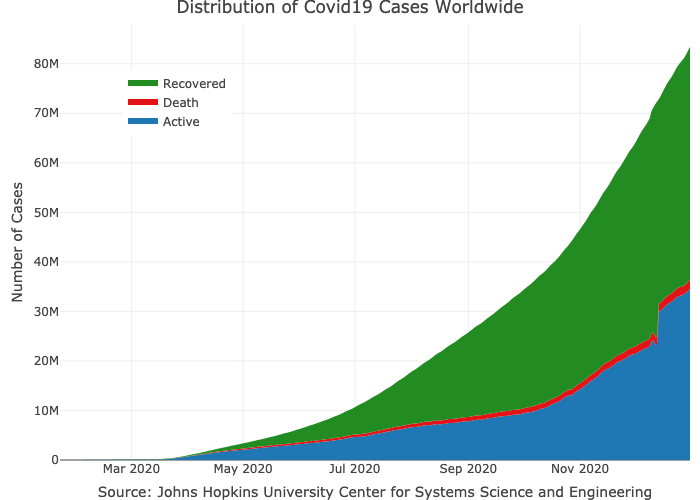
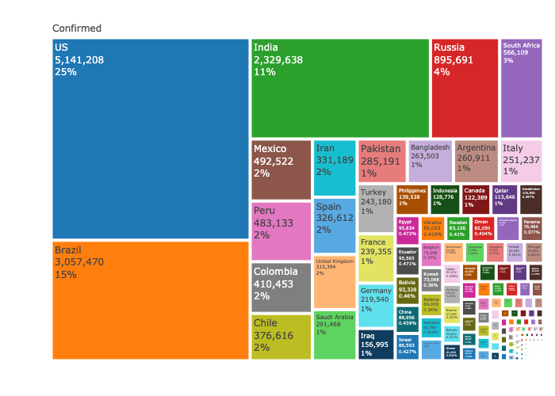

<!-- README.md is generated from README.Rmd. Please edit that file -->

# coronavirus <a href='https://RamiKrispin.github.io/coronavirus/'></a>

<!-- badges: start --->

[](https://github.com/RamiKrispin/coronavirus/actions?query=workflow%3Abuild)
[](https://cran.r-project.org/package=coronavirus)
[](https://www.tidyverse.org/lifecycle/#maturing)
[](https://opensource.org/licenses/MIT)
[](https://github.com/RamiKrispin/coronavirus/commit/master)
[](https://cran.r-project.org/package=coronavirus)

<!-- badges: end -->

The coronavirus package provides a tidy format dataset of the 2019 Novel
Coronavirus COVID-19 (2019-nCoV) epidemic. The raw data pulled from the
Johns Hopkins University Center for Systems Science and Engineering (JHU
CCSE) Coronavirus
[repository](https://github.com/CSSEGISandData/COVID-19).

More details available
[here](https://RamiKrispin.github.io/coronavirus/), and a `csv` format
of the package dataset available
[here](https://github.com/RamiKrispin/coronavirus-csv)

A summary dashboard is available
[here](https://ramikrispin.github.io/coronavirus_dashboard/)

</a>

<figcaption>

Source: Centers for Disease Control and Prevention’s Public Health Image
Library

</figcaption>

## Important Note

As this an ongoing situation, frequent changes in the data format may
occur, please visit the package news to get updates about those changes

## Installation

Install the CRAN version:

``` r
install.packages("coronavirus")
```

Install the Github version (refreshed on a daily bases):

``` r
# install.packages("devtools")
devtools::install_github("RamiKrispin/coronavirus")
```

## Data refresh

While the **coronavirus** [CRAN
version](https://cran.r-project.org/package=coronavirus) is updated
every month or two, the [Github (Dev)
version](https://github.com/RamiKrispin/coronavirus) is updated on a
daily bases. The `update_dataset` function enables to overcome this gap
and keep the installed version with the most recent data available on
the Github version:

``` r
library(coronavirus)
update_dataset()
```

**Note:** must restart the R session to have the updates available

## Usage

``` r
data("coronavirus")
```

This `coronavirus` dataset has the following fields:

  - `date` - The date of the summary
  - `province` - The province or state, when applicable
  - `country` - The country or region name
  - `lat` - Latitude point
  - `long` - Longitude point
  - `type` - the type of case (i.e., confirmed, death)
  - `cases` - the number of daily cases (corresponding to the case type)

<!-- end list -->

``` r
head(coronavirus)
#>         date province     country lat long      type cases
#> 1 2020-01-22          Afghanistan  33   65 confirmed     0
#> 2 2020-01-23          Afghanistan  33   65 confirmed     0
#> 3 2020-01-24          Afghanistan  33   65 confirmed     0
#> 4 2020-01-25          Afghanistan  33   65 confirmed     0
#> 5 2020-01-26          Afghanistan  33   65 confirmed     0
#> 6 2020-01-27          Afghanistan  33   65 confirmed     0
```

Summary of the total confrimed cases by country (top 20):

``` r
library(dplyr)

summary_df <- coronavirus %>% 
  filter(type == "confirmed") %>%
  group_by(country) %>%
  summarise(total_cases = sum(cases)) %>%
  arrange(-total_cases)

summary_df %>% head(20) 
#> # A tibble: 20 x 2
#>    country        total_cases
#>    <chr>                <int>
#>  1 US                 1369376
#>  2 Russia              232243
#>  3 Spain               228030
#>  4 United Kingdom      227741
#>  5 Italy               221216
#>  6 France              178349
#>  7 Brazil              178214
#>  8 Germany             173171
#>  9 Turkey              141475
#> 10 Iran                110767
#> 11 China                84018
#> 12 India                74292
#> 13 Canada               72419
#> 14 Peru                 72059
#> 15 Belgium              53779
#> 16 Netherlands          43183
#> 17 Saudi Arabia         42925
#> 18 Mexico               38324
#> 19 Pakistan             34336
#> 20 Chile                31721
```

Summary of new cases during the past 24 hours by country and type (as of
2020-05-12):

``` r
library(tidyr)

coronavirus %>% 
  filter(date == max(date)) %>%
  select(country, type, cases) %>%
  group_by(country, type) %>%
  summarise(total_cases = sum(cases)) %>%
  pivot_wider(names_from = type,
              values_from = total_cases) %>%
  arrange(-confirmed)
#> # A tibble: 187 x 4
#> # Groups:   country [187]
#>    country              confirmed death recovered
#>    <chr>                    <int> <int>     <int>
#>  1 US                       21495  1674     -2446
#>  2 Russia                   10899   107      3711
#>  3 Brazil                    8620   808      5213
#>  4 India                     3524   121      1871
#>  5 United Kingdom            3409   628         8
#>  6 Peru                      3237    96       918
#>  7 Pakistan                  2255    31       257
#>  8 Mexico                    1997   353      2835
#>  9 Saudi Arabia              1911     9      2520
#> 10 Turkey                    1704    53      3109
#> 11 Chile                     1658    12       520
#> 12 Qatar                     1526     0       179
#> 13 Iran                      1481    48       935
#> 14 Italy                     1402   172      2452
#> 15 Canada                    1155   185      1048
#> 16 Kuwait                     991    10       194
#> 17 Bangladesh                 969    11       245
#> 18 Belarus                    967     7       443
#> 19 Ecuador                    910   182         0
#> 20 Singapore                  849     0       626
#> 21 France                     802   348      1063
#> 22 United Arab Emirates       783     2       631
#> 23 South Africa               698     0         0
#> 24 Colombia                   659    14       146
#> 25 Sweden                     602    57         0
#> 26 Germany                    595    77      1583
#> 27 Poland                     595    28       315
#> 28 Spain                      594   176      1841
#> 29 Indonesia                  484    16       182
#> 30 Ghana                      427     0         0
#> 31 Ukraine                    375    17        85
#> 32 Egypt                      347    11       154
#> 33 Belgium                    330    54        35
#> 34 Bahrain                    295     1        40
#> 35 Argentina                  285     5        25
#> 36 Afghanistan                276     5        52
#> 37 Dominican Republic         266     9       351
#> 38 Philippines                264    25       107
#> 39 Portugal                   234    19       464
#> 40 Netherlands                196    54         0
#> # … with 147 more rows
```

Plotting the total cases by type worldwide:

``` r
library(plotly)

coronavirus %>% 
  group_by(type, date) %>%
  summarise(total_cases = sum(cases)) %>%
  pivot_wider(names_from = type, values_from = total_cases) %>%
  arrange(date) %>%
  mutate(active = confirmed - death - recovered) %>%
  mutate(active_total = cumsum(active),
                recovered_total = cumsum(recovered),
                death_total = cumsum(death)) %>%
  plot_ly(x = ~ date,
                  y = ~ active_total,
                  name = 'Active', 
                  fillcolor = '#1f77b4',
                  type = 'scatter',
                  mode = 'none', 
                  stackgroup = 'one') %>%
  add_trace(y = ~ death_total, 
             name = "Death",
             fillcolor = '#E41317') %>%
  add_trace(y = ~recovered_total, 
            name = 'Recovered', 
            fillcolor = 'forestgreen') %>%
  layout(title = "Distribution of Covid19 Cases Worldwide",
         legend = list(x = 0.1, y = 0.9),
         yaxis = list(title = "Number of Cases"),
         xaxis = list(title = "Source: Johns Hopkins University Center for Systems Science and Engineering"))
```



Plot the confirmed cases distribution by counrty with treemap plot:

``` r
conf_df <- coronavirus %>% 
  filter(type == "confirmed") %>%
  group_by(country) %>%
  summarise(total_cases = sum(cases)) %>%
  arrange(-total_cases) %>%
  mutate(parents = "Confirmed") %>%
  ungroup() 
  
  plot_ly(data = conf_df,
          type= "treemap",
          values = ~total_cases,
          labels= ~ country,
          parents=  ~parents,
          domain = list(column=0),
          name = "Confirmed",
          textinfo="label+value+percent parent")
```



## Data Sources

The raw data pulled and arranged by the Johns Hopkins University Center
for Systems Science and Engineering (JHU CCSE) from the following
resources:

  - World Health Organization (WHO): <https://www.who.int/> <br>
  - DXY.cn. Pneumonia. 2020. <http://3g.dxy.cn/newh5/view/pneumonia>.
    <br>
  - BNO News:
    <https://bnonews.com/index.php/2020/02/the-latest-coronavirus-cases/>
    <br>
  - National Health Commission of the People’s Republic of China (NHC):
    <br> http:://www.nhc.gov.cn/xcs/yqtb/list\_gzbd.shtml <br>
  - China CDC (CCDC):
    http:://weekly.chinacdc.cn/news/TrackingtheEpidemic.htm <br>
  - Hong Kong Department of Health:
    <https://www.chp.gov.hk/en/features/102465.html> <br>
  - Macau Government: <https://www.ssm.gov.mo/portal/> <br>
  - Taiwan CDC:
    <https://sites.google.com/cdc.gov.tw/2019ncov/taiwan?authuser=0>
    <br>
  - US CDC: <https://www.cdc.gov/coronavirus/2019-ncov/index.html> <br>
  - Government of Canada:
    <https://www.canada.ca/en/public-health/services/diseases/coronavirus.html>
    <br>
  - Australia Government Department of Health:
    <https://www.health.gov.au/news/coronavirus-update-at-a-glance> <br>
  - European Centre for Disease Prevention and Control (ECDC):
    <https://www.ecdc.europa.eu/en/geographical-distribution-2019-ncov-cases>
  - Ministry of Health Singapore (MOH):
    <https://www.moh.gov.sg/covid-19>
  - Italy Ministry of Health:
    <http://www.salute.gov.it/nuovocoronavirus>
  - 1Point3Arces: <https://coronavirus.1point3acres.com/en>
  - WorldoMeters: <https://www.worldometers.info/coronavirus/>
  - COVID Tracking Project: <https://covidtracking.com/data>. (US
    Testing and Hospitalization Data. We use the maximum reported value
    from “Currently” and “Cumulative” Hospitalized for our
    hospitalization number reported for each state.)
  - French Government: <https://dashboard.covid19.data.gouv.fr/>
  - COVID Live (Australia): <https://www.covidlive.com.au/>
  - Washington State Department of Health:
    <https://www.doh.wa.gov/emergencies/coronavirus>
  - Maryland Department of Health: <https://coronavirus.maryland.gov/>
  - New York State Department of Health:
    <https://health.data.ny.gov/Health/New-York-State-Statewide-COVID-19-Testing/xdss-u53e/data>
  - NYC Department of Health and Mental Hygiene:
    <https://www1.nyc.gov/site/doh/covid/covid-19-data.page> and
    <https://github.com/nychealth/coronavirus-data>
  - Florida Department of Health Dashboard:
    <https://services1.arcgis.com/CY1LXxl9zlJeBuRZ/arcgis/rest/services/Florida_COVID19_Cases/FeatureServer/0>
    and
    <https://fdoh.maps.arcgis.com/apps/opsdashboard/index.html#/8d0de33f260d444c852a615dc7837c86>
  - Palestine (West Bank and Gaza): <https://corona.ps/details>
  - Israel:
    <https://govextra.gov.il/ministry-of-health/corona/corona-virus/>
  - Colorado: <https://covid19.colorado.gov/covid-19-data>
