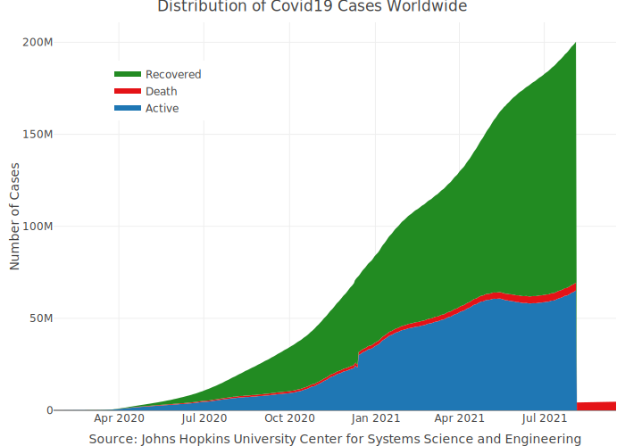

<!-- README.md is generated from README.Rmd. Please edit that file -->

# coronavirus <a href='https://RamiKrispin.github.io/coronavirus/'></a>

<!-- badges: start --->

[](https://github.com/RamiKrispin/coronavirus/actions?query=workflow%3Abuild)
[](https://cran.r-project.org/package=coronavirus)
[](https://lifecycle.r-lib.org/articles/stages.html)
[](https://opensource.org/licenses/MIT)
[](https://github.com/RamiKrispin/coronavirus/commit/master)
[](https://cran.r-project.org/package=coronavirus)

<!-- badges: end -->

The coronavirus package provides a tidy format dataset of the 2019 Novel
Coronavirus COVID-19 (2019-nCoV) epidemic. The raw data pulled from the
Johns Hopkins University Center for Systems Science and Engineering (JHU
CCSE) Coronavirus
[repository](https://github.com/CSSEGISandData/COVID-19).

More details available
[here](https://RamiKrispin.github.io/coronavirus/), and a `csv` format
of the package dataset available
[here](https://github.com/RamiKrispin/coronavirus/tree/master/csv)

</a>

<figcaption>
Source: Centers for Disease Control and Prevention’s Public Health Image
Library
</figcaption>

## Important Note

As this an ongoing situation, frequent changes in the data format may
occur, please visit the package news to get updates about those changes

## Installation

Install the CRAN version:

``` r
install.packages("coronavirus")
```

Install the Github version (refreshed on a daily bases):

``` r
# install.packages("devtools")
devtools::install_github("RamiKrispin/coronavirus")
```

## Data refresh

While the **coronavirus** [CRAN
version](https://cran.r-project.org/package=coronavirus) is updated
every month or two, the [Github (Dev)
version](https://github.com/RamiKrispin/coronavirus) is updated on a
daily bases. The `update_dataset` function enables to overcome this gap
and keep the installed version with the most recent data available on
the Github version:

``` r
library(coronavirus)
update_dataset()
```

**Note:** must restart the R session to have the updates available

Alternatively, you can pull the data using the
[Covid19R](https://covid19r.github.io/documentation/) project [data
standard
format](https://covid19r.github.io/documentation/data-format-standard.html)
with the `refresh_coronavirus_jhu` function:

``` r
covid19_df <- refresh_coronavirus_jhu()
head(covid19_df)
#>         date        location location_type location_code location_code_type  data_type value     lat      long
#> 1 2020-10-10 Alberta, Canada         state         CA-AB         iso_3166_2 deaths_new     0 53.9333 -116.5765
#> 2 2020-08-09 Alberta, Canada         state         CA-AB         iso_3166_2  cases_new     0 53.9333 -116.5765
#> 3 2020-10-21 Alberta, Canada         state         CA-AB         iso_3166_2  cases_new   406 53.9333 -116.5765
#> 4 2020-06-15 Alberta, Canada         state         CA-AB         iso_3166_2 deaths_new     1 53.9333 -116.5765
#> 5 2020-06-13 Alberta, Canada         state         CA-AB         iso_3166_2  cases_new    37 53.9333 -116.5765
#> 6 2020-06-21 Alberta, Canada         state         CA-AB         iso_3166_2  cases_new    31 53.9333 -116.5765
```

## Dashboard

A supporting dashboard is available
[here](https://ramikrispin.github.io/coronavirus_dashboard/)

[](https://ramikrispin.github.io/coronavirus_dashboard/)

## Usage

``` r
data("coronavirus")
```

This `coronavirus` dataset has the following fields:

-   `date` - The date of the summary
-   `province` - The province or state, when applicable
-   `country` - The country or region name
-   `lat` - Latitude point
-   `long` - Longitude point
-   `type` - the type of case (i.e., confirmed, death)
-   `cases` - the number of daily cases (corresponding to the case type)

``` r
head(coronavirus)
#>         date province             country       lat       long      type cases
#> 1 2020-01-22     <NA>         Afghanistan  33.93911  67.709953 confirmed     0
#> 2 2020-01-22     <NA>             Albania  41.15330  20.168300 confirmed     0
#> 3 2020-01-22     <NA>             Algeria  28.03390   1.659600 confirmed     0
#> 4 2020-01-22     <NA>             Andorra  42.50630   1.521800 confirmed     0
#> 5 2020-01-22     <NA>              Angola -11.20270  17.873900 confirmed     0
#> 6 2020-01-22     <NA> Antigua and Barbuda  17.06080 -61.796400 confirmed     0
```

Summary of the total confrimed cases by country (top 20):

``` r
library(dplyr)

summary_df <- coronavirus %>% 
  filter(type == "confirmed") %>%
  group_by(country) %>%
  summarise(total_cases = sum(cases)) %>%
  arrange(-total_cases)

summary_df %>% head(20) 
#> # A tibble: 20 x 2
#>    country        total_cases
#>    <chr>                <dbl>
#>  1 US                24821813
#>  2 India             10639684
#>  3 Brazil             8753920
#>  4 Russia             3637862
#>  5 United Kingdom     3594094
#>  6 France             3069695
#>  7 Spain              2499560
#>  8 Italy              2441854
#>  9 Turkey             2418472
#> 10 Germany            2125261
#> 11 Colombia           1987418
#> 12 Argentina          1853830
#> 13 Mexico             1732290
#> 14 Poland             1464448
#> 15 South Africa       1392568
#> 16 Iran               1360852
#> 17 Ukraine            1222459
#> 18 Peru               1082907
#> 19 Indonesia           965283
#> 20 Netherlands         951747
```

Summary of new cases during the past 24 hours by country and type (as of
2021-01-22):

``` r
library(tidyr)

coronavirus %>% 
  filter(date == max(date)) %>%
  select(country, type, cases) %>%
  group_by(country, type) %>%
  summarise(total_cases = sum(cases)) %>%
  pivot_wider(names_from = type,
              values_from = total_cases) %>%
  arrange(-confirmed)
#> # A tibble: 192 x 4
#> # Groups:   country [192]
#>    country              confirmed death recovered
#>    <chr>                    <dbl> <dbl>     <dbl>
#>  1 US                      189925  3758         0
#>  2 Brazil                   56552  1096     73818
#>  3 Spain                    42885   400         0
#>  4 United Kingdom           40321  1401        97
#>  5 France                   23324   649      1287
#>  6 Russia                   21182   566     26976
#>  7 Mexico                   21007  1440     27160
#>  8 Germany                  16366   837     16246
#>  9 Colombia                 15073   399     10418
#> 10 India                    14256   152     17136
#> 11 Portugal                 13987   234      7319
#> 12 Italy                    13633   472     27676
#> 13 Indonesia                13632   250      8357
#> 14 South Africa             11761   575     17841
#> 15 Argentina                10753   220     11071
#> 16 Peru                      9693   230         0
#> 17 Czechia                   7488   157     13320
#> 18 Poland                    6693   347         0
#> 19 Iran                      6332    75      7127
#> 20 Israel                    6159    21      7243
#> 21 Turkey                    5967   149      6018
#> 22 Canada                    5827   123      6939
#> 23 Netherlands               5799    89       103
#> 24 Ukraine                   5679   177     14581
#> 25 Japan                     5045   108      6027
#> 26 Chile                     4959    84      3031
#> 27 Sweden                    4214    84         0
#> 28 Malaysia                  3631    18      2554
#> 29 United Arab Emirates      3552    10      3945
#> 30 Lebanon                   3220    57      3185
#> 31 Romania                   2699    74      4635
#> 32 Belgium                   2444    55         0
#> 33 Tunisia                   2389   103      2720
#> 34 Ireland                   2357    52         0
#> 35 Philippines               2170    20       245
#> 36 Switzerland               2156    63         0
#> 37 Austria                   2088    42      2048
#> 38 Panama                    2041    36      3288
#> 39 Pakistan                  1927    43      1737
#> 40 Bolivia                   1864    53      1006
#> # … with 152 more rows
```

Plotting the total cases by type worldwide:

``` r
library(plotly)

coronavirus %>% 
  group_by(type, date) %>%
  summarise(total_cases = sum(cases)) %>%
  pivot_wider(names_from = type, values_from = total_cases) %>%
  arrange(date) %>%
  mutate(active = confirmed - death - recovered) %>%
  mutate(active_total = cumsum(active),
                recovered_total = cumsum(recovered),
                death_total = cumsum(death)) %>%
  plot_ly(x = ~ date,
                  y = ~ active_total,
                  name = 'Active', 
                  fillcolor = '#1f77b4',
                  type = 'scatter',
                  mode = 'none', 
                  stackgroup = 'one') %>%
  add_trace(y = ~ death_total, 
             name = "Death",
             fillcolor = '#E41317') %>%
  add_trace(y = ~recovered_total, 
            name = 'Recovered', 
            fillcolor = 'forestgreen') %>%
  layout(title = "Distribution of Covid19 Cases Worldwide",
         legend = list(x = 0.1, y = 0.9),
         yaxis = list(title = "Number of Cases"),
         xaxis = list(title = "Source: Johns Hopkins University Center for Systems Science and Engineering"))
```



Plot the confirmed cases distribution by counrty with treemap plot:

``` r
conf_df <- coronavirus %>% 
  filter(type == "confirmed") %>%
  group_by(country) %>%
  summarise(total_cases = sum(cases)) %>%
  arrange(-total_cases) %>%
  mutate(parents = "Confirmed") %>%
  ungroup() 
  
  plot_ly(data = conf_df,
          type= "treemap",
          values = ~total_cases,
          labels= ~ country,
          parents=  ~parents,
          domain = list(column=0),
          name = "Confirmed",
          textinfo="label+value+percent parent")
```


## Data Sources

The raw data pulled and arranged by the Johns Hopkins University Center
for Systems Science and Engineering (JHU CCSE) from the following
resources:

-   World Health Organization (WHO): <https://www.who.int/> <br>
-   DXY.cn. Pneumonia. 2020.
    <https://ncov.dxy.cn/ncovh5/view/pneumonia>. <br>
-   BNO News:
    <https://bnonews.com/index.php/2020/04/the-latest-coronavirus-cases/>
    <br>
-   National Health Commission of the People’s Republic of China (NHC):
    <br> http:://www.nhc.gov.cn/xcs/yqtb/list\_gzbd.shtml <br>
-   China CDC (CCDC):
    http:://weekly.chinacdc.cn/news/TrackingtheEpidemic.htm <br>
-   Hong Kong Department of Health:
    <https://www.chp.gov.hk/en/features/102465.html> <br>
-   Macau Government: <https://www.ssm.gov.mo/portal/> <br>
-   Taiwan CDC:
    <https://sites.google.com/cdc.gov.tw/2019ncov/taiwan?authuser=0>
    <br>
-   US CDC: <https://www.cdc.gov/coronavirus/2019-ncov/index.html> <br>
-   Government of Canada:
    <https://www.canada.ca/en/public-health/services/diseases/2019-novel-coronavirus-infection/symptoms.html>
    <br>
-   Australia Government Department of
    Health:<https://www.health.gov.au/news/health-alerts/novel-coronavirus-2019-ncov-health-alert>
    <br>
-   European Centre for Disease Prevention and Control (ECDC):
    <https://www.ecdc.europa.eu/en/geographical-distribution-2019-ncov-cases>
-   Ministry of Health Singapore (MOH):
    <https://www.moh.gov.sg/covid-19>
-   Italy Ministry of Health:
    <http://www.salute.gov.it/nuovocoronavirus>
-   1Point3Arces: <https://coronavirus.1point3acres.com/en>
-   WorldoMeters: <https://www.worldometers.info/coronavirus/>
-   COVID Tracking Project: <https://covidtracking.com/data>. (US
    Testing and Hospitalization Data. We use the maximum reported value
    from “Currently” and “Cumulative” Hospitalized for our
    hospitalization number reported for each state.)
-   French Government: <https://dashboard.covid19.data.gouv.fr/>
-   COVID Live (Australia): <https://covidlive.com.au/>
-   Washington State Department of
    Health:<https://www.doh.wa.gov/Emergencies/COVID19>
-   Maryland Department of Health: <https://coronavirus.maryland.gov/>
-   New York State Department of Health:
    <https://health.data.ny.gov/Health/New-York-State-Statewide-COVID-19-Testing/xdss-u53e/data>
-   NYC Department of Health and Mental Hygiene:
    <https://www1.nyc.gov/site/doh/covid/covid-19-data.page> and
    <https://github.com/nychealth/coronavirus-data>
-   Florida Department of Health Dashboard:
    <https://services1.arcgis.com/CY1LXxl9zlJeBuRZ/arcgis/rest/services/Florida_COVID19_Cases/FeatureServer/0>
    and
    <https://fdoh.maps.arcgis.com/apps/opsdashboard/index.html#/8d0de33f260d444c852a615dc7837c86>
-   Palestine (West Bank and Gaza): <https://corona.ps/details>
-   Israel:
    <https://govextra.gov.il/ministry-of-health/corona/corona-virus/>
-   Colorado: <https://covid19.colorado.gov/data>)
