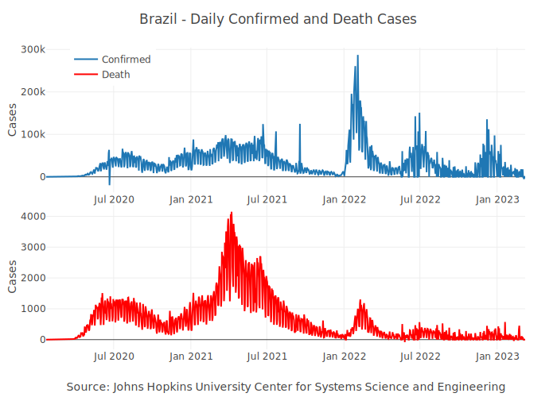

<!-- README.md is generated from README.Rmd. Please edit that file -->

# coronavirus <a href='https://RamiKrispin.github.io/coronavirus/'></a>

<!-- badges: start --->

[](https://github.com/RamiKrispin/coronavirus/actions/workflows/main.yml)
[](https://github.com/RamiKrispin/coronavirus/actions/workflows/data_refresh.yml)
[](https://cran.r-project.org/package=coronavirus)
[](https://lifecycle.r-lib.org/articles/stages.html#maturing)
[](https://opensource.org/licenses/MIT)
[](https://github.com/RamiKrispin/coronavirus/commit/master)
[](https://cran.r-project.org/package=coronavirus)

<!-- badges: end -->

The coronavirus package provides a tidy format dataset of the 2019 Novel
Coronavirus COVID-19 (2019-nCoV) epidemic and the vaccination efforts by
country. The raw data is being pulled from the Johns Hopkins University
Center for Systems Science and Engineering (JHU CCSE) Coronavirus
[repository](https://github.com/CSSEGISandData/COVID-19).

More details available
[here](https://RamiKrispin.github.io/coronavirus/), and a `csv` format
of the package dataset available
[here](https://github.com/RamiKrispin/coronavirus/tree/master/csv)

</a>

<figcaption>
Source: Centers for Disease Control and Prevention’s Public Health Image
Library
</figcaption>

## Important Notes

-   As this an ongoing situation, frequent changes in the data format
    may occur, please visit the package
    [changelog](https://ramikrispin.github.io/coronavirus/news/index.html)
    (e.g., News) and/or see pinned
    [issues](https://github.com/RamiKrispin/coronavirus/issues) to get
    updates about those changes
-   As of Auguest 4th JHU CCSE stopped track recovery cases, please see
    this [issue](https://github.com/RamiKrispin/coronavirus/issues/71)
    for more details
-   Negative values and/or anomalies may occurred in the data for the
    following reasons:
    -   The calculation of the daily cases from the raw data which is in
        cumulative format is done by taking the daily difference. In
        some cases, some retro updates not tie to the day that they
        actually occurred such as removing false positive cases
    -   Anomalies or error in the raw data
    -   Please see this
        [issue](https://github.com/RamiKrispin/coronavirus/issues/55)
        for more details

## Vignettes

Additional documentation available on the followng vignettes:

-   [Introduction to the Coronavirus
    Dataset](https://ramikrispin.github.io/coronavirus/articles/intro_coronavirus_dataset.html)
-   [Covid19R Project Data
    Format](https://ramikrispin.github.io/coronavirus/articles/covid19R.html)
-   [Update the coronavirus
    Dataset](https://ramikrispin.github.io/coronavirus/articles/update_dataset_function.html)
-   [Covid19 Vaccine
    Data](https://ramikrispin.github.io/coronavirus/articles/covid19_vaccine.html)
-   [Geospatial
    Visualization](https://ramikrispin.github.io/coronavirus/articles/geospatial_visualization.html)

## Installation

Install the CRAN version:

``` r
install.packages("coronavirus")
```

Install the Github version (refreshed on a daily bases):

``` r
# install.packages("devtools")
devtools::install_github("RamiKrispin/coronavirus")
```

## Datasets

The package provides the following two datasets:

-   **coronavirus** - tidy (long) format of the JHU CCSE
    [datasets](https://github.com/CSSEGISandData/COVID-19/tree/master/csse_covid_19_data/csse_covid_19_time_series).
    That includes the following columns:

    -   `date` - The date of the observation, using `Date` class
    -   `province` - Name of province/state, for countries where data is
        provided split across multiple provinces/states
    -   `country` - Name of country/region
    -   `lat` - The latitude code
    -   `long` - The longitude code
    -   `type` - An indicator for the type of cases (confirmed, death,
        recovered)
    -   `cases` - Number of cases on given date
    -   `uid` - Country code
    -   `province_state` - Province or state if applicable
    -   `iso2` - Officially assigned country code identifiers with
        two-letter
    -   `iso3` - Officially assigned country code identifiers with
        three-letter
    -   `code3` - UN country code
    -   `fips` - Federal Information Processing Standards code that
        uniquely identifies counties within the USA
    -   `combined_key` - Country and province (if applicable)
    -   `population` - Country or province population
    -   `continent_name` - Continent name
    -   `continent_code` - Continent code

-   **covid19\_vaccine** - a tidy (long) format of the the Johns Hopkins
    [Centers for Civic Impact](https://civicimpact.jhu.edu/) global
    vaccination
    [dataset](https://github.com/govex/COVID-19/tree/master/data_tables/vaccine_data)
    by country. This dataset includes the following columns:

    -   `country_region` - Country or region name
    -   `date` - Data collection date in YYYY-MM-DD format
    -   `doses_admin` - Cumulative number of doses administered. When a
        vaccine requires multiple doses, each one is counted
        independently
    -   `people_partially_vaccinated` - Cumulative number of people who
        received at least one vaccine dose. When the person receives a
        prescribed second dose, it is not counted twice
    -   `people_fully_vaccinated` - Cumulative number of people who
        received all prescribed doses necessary to be considered fully
        vaccinated
    -   `report_date_string` - Data report date in YYYY-MM-DD format
    -   `uid` - Country code
    -   `province_state` - Province or state if applicable
    -   `iso2` - Officially assigned country code identifiers with
        two-letter
    -   `iso3` - Officially assigned country code identifiers with
        three-letter
    -   `code3` - UN country code
    -   `fips` - Federal Information Processing Standards code that
        uniquely identifies counties within the USA
    -   `lat` - Latitude
    -   `long` - Longitude
    -   `combined_key` - Country and province (if applicable)
    -   `population` - Country or province population
    -   `continent_name` - Continent name
    -   `continent_code` - Continent code

## Data refresh

While the **coronavirus** [CRAN
version](https://cran.r-project.org/package=coronavirus) is updated
every month or two, the [Github (Dev)
version](https://github.com/RamiKrispin/coronavirus) is updated on a
daily bases. The `update_dataset` function enables to overcome this gap
and keep the installed version with the most recent data available on
the Github version:

``` r
library(coronavirus)
update_dataset()
```

**Note:** must restart the R session to have the updates available

Alternatively, you can pull the data using the
[Covid19R](https://covid19r.github.io/documentation/) project [data
standard
format](https://covid19r.github.io/documentation/data-format-standard.html)
with the `refresh_coronavirus_jhu` function:

``` r
covid19_df <- refresh_coronavirus_jhu()
head(covid19_df)
#>         date    location location_type location_code location_code_type  data_type value      lat      long
#> 1 2021-10-04 Afghanistan       country            AF         iso_3166_2 deaths_new     6 33.93911 67.709953
#> 2 2021-10-03 Afghanistan       country            AF         iso_3166_2 deaths_new     0 33.93911 67.709953
#> 3 2020-11-09 Afghanistan       country            AF         iso_3166_2 deaths_new     6 33.93911 67.709953
#> 4 2021-10-10 Afghanistan       country            AF         iso_3166_2 deaths_new     4 33.93911 67.709953
#> 5 2021-10-06 Afghanistan       country            AF         iso_3166_2 deaths_new     6 33.93911 67.709953
#> 6 2020-11-10 Afghanistan       country            AF         iso_3166_2 deaths_new    12 33.93911 67.709953
```

## Usage

``` r
data("coronavirus")

head(coronavirus)
#>         date province country     lat      long      type cases
#> 1 2020-01-22  Alberta  Canada 53.9333 -116.5765 confirmed     0
#> 2 2020-01-23  Alberta  Canada 53.9333 -116.5765 confirmed     0
#> 3 2020-01-24  Alberta  Canada 53.9333 -116.5765 confirmed     0
#> 4 2020-01-25  Alberta  Canada 53.9333 -116.5765 confirmed     0
#> 5 2020-01-26  Alberta  Canada 53.9333 -116.5765 confirmed     0
#> 6 2020-01-27  Alberta  Canada 53.9333 -116.5765 confirmed     0
```

Summary of the total confrimed cases by country (top 20):

``` r
library(dplyr)

summary_df <- coronavirus %>% 
  filter(type == "confirmed") %>%
  group_by(country) %>%
  summarise(total_cases = sum(cases)) %>%
  arrange(-total_cases)

summary_df %>% head(20) 
#> # A tibble: 20 × 2
#>    country        total_cases
#>    <chr>                <int>
#>  1 US                44683014
#>  2 India             34020730
#>  3 Brazil            21597949
#>  4 United Kingdom     8311851
#>  5 Russia             7742899
#>  6 Turkey             7540193
#>  7 France             7164924
#>  8 Iran               5742083
#>  9 Argentina          5268653
#> 10 Spain              4980206
#> 11 Colombia           4975656
#> 12 Italy              4707087
#> 13 Germany            4343591
#> 14 Indonesia          4231046
#> 15 Mexico             3732429
#> 16 Poland             2928065
#> 17 South Africa       2913880
#> 18 Ukraine            2697176
#> 19 Philippines        2690455
#> 20 Malaysia           2361529
```

Summary of new cases during the past 24 hours by country and type (as of
2021-10-13):

``` r
library(tidyr)

coronavirus %>% 
  filter(date == max(date)) %>%
  select(country, type, cases) %>%
  group_by(country, type) %>%
  summarise(total_cases = sum(cases)) %>%
  pivot_wider(names_from = type,
              values_from = total_cases) %>%
  arrange(-confirmed)
#> # A tibble: 195 × 4
#> # Groups:   country [195]
#>    country        confirmed death recovered
#>    <chr>              <int> <int>     <int>
#>  1 US                120321  3054        NA
#>  2 United Kingdom     41669   136        NA
#>  3 Turkey             31248   236        NA
#>  4 Russia             27926   962        NA
#>  5 India              18987   246        NA
#>  6 Ukraine            17100   493        NA
#>  7 Romania            15733   390        NA
#>  8 Germany            12317    14        NA
#>  9 Iran               12298   194        NA
#> 10 Thailand           10064    82        NA
#> 11 Malaysia            7950    68        NA
#> 12 Brazil              7852   176        NA
#> 13 Philippines         7083   173        NA
#> 14 Serbia              6699    51        NA
#> 15 Georgia             4837    26        NA
#> 16 Netherlands         3772    13        NA
#> 17 Belgium             3667    13        NA
#> 18 Vietnam             3461   106        NA
#> 19 Bulgaria            3327    98        NA
#> 20 Singapore           3190     9        NA
#> 21 Cameroon            3003    33        NA
#> 22 Italy               2769    37        NA
#> 23 Spain               2758    42        NA
#> 24 Australia           2744    18        NA
#> 25 Lithuania           2740    26        NA
#> 26 Canada              2706    79        NA
#> 27 Poland              2640    40        NA
#> 28 Austria             2614    15        NA
#> 29 Slovakia            2406    20        NA
#> 30 Cuba                2354    28        NA
#> 31 Greece              2312    31        NA
#> 32 Latvia              2236    17        NA
#> 33 Kazakhstan          2084    35        NA
#> 34 Belarus             2060    17        NA
#> 35 Moldova             2052    29        NA
#> 36 Ireland             2051    26        NA
#> 37 Croatia             2022    27        NA
#> 38 Korea, South        1937    13        NA
#> 39 Mongolia            1920    15        NA
#> 40 Iraq                1766    35        NA
#> # … with 155 more rows
```

Plotting daily confirmed and death cases in Brazil:

``` r
library(plotly)

coronavirus %>% 
  group_by(type, date) %>%
  summarise(total_cases = sum(cases)) %>%
  pivot_wider(names_from = type, values_from = total_cases) %>%
  arrange(date) %>%
  mutate(active = confirmed - death - recovered) %>%
  mutate(active_total = cumsum(active),
                recovered_total = cumsum(recovered),
                death_total = cumsum(death)) %>%
  plot_ly(x = ~ date,
                  y = ~ active_total,
                  name = 'Active', 
                  fillcolor = '#1f77b4',
                  type = 'scatter',
                  mode = 'none', 
                  stackgroup = 'one') %>%
  add_trace(y = ~ death_total, 
             name = "Death",
             fillcolor = '#E41317') %>%
  add_trace(y = ~recovered_total, 
            name = 'Recovered', 
            fillcolor = 'forestgreen') %>%
  layout(title = "Distribution of Covid19 Cases Worldwide",
         legend = list(x = 0.1, y = 0.9),
         yaxis = list(title = "Number of Cases"),
         xaxis = list(title = "Source: Johns Hopkins University Center for Systems Science and Engineering"))
```



Plot the confirmed cases distribution by counrty with treemap plot:

``` r
conf_df <- coronavirus %>% 
  filter(type == "confirmed") %>%
  group_by(country) %>%
  summarise(total_cases = sum(cases)) %>%
  arrange(-total_cases) %>%
  mutate(parents = "Confirmed") %>%
  ungroup() 
  
  plot_ly(data = conf_df,
          type= "treemap",
          values = ~total_cases,
          labels= ~ country,
          parents=  ~parents,
          domain = list(column=0),
          name = "Confirmed",
          textinfo="label+value+percent parent")
```


``` r
data(covid19_vaccine)

head(covid19_vaccine)
#>   country_region       date doses_admin people_partially_vaccinated people_fully_vaccinated report_date_string uid province_state iso2 iso3 code3 fips      lat      long combined_key population
#> 1    Afghanistan 2021-02-22           0                           0                       0         2021-02-22   4           <NA>   AF  AFG     4 <NA> 33.93911 67.709953  Afghanistan   38928341
#> 2    Afghanistan 2021-02-23           0                           0                       0         2021-02-23   4           <NA>   AF  AFG     4 <NA> 33.93911 67.709953  Afghanistan   38928341
#> 3    Afghanistan 2021-02-24           0                           0                       0         2021-02-24   4           <NA>   AF  AFG     4 <NA> 33.93911 67.709953  Afghanistan   38928341
#> 4    Afghanistan 2021-02-25           0                           0                       0         2021-02-25   4           <NA>   AF  AFG     4 <NA> 33.93911 67.709953  Afghanistan   38928341
#> 5    Afghanistan 2021-02-26           0                           0                       0         2021-02-26   4           <NA>   AF  AFG     4 <NA> 33.93911 67.709953  Afghanistan   38928341
#> 6    Afghanistan 2021-02-27           0                           0                       0         2021-02-27   4           <NA>   AF  AFG     4 <NA> 33.93911 67.709953  Afghanistan   38928341
#>   continent_name continent_code
#> 1           Asia             AS
#> 2           Asia             AS
#> 3           Asia             AS
#> 4           Asia             AS
#> 5           Asia             AS
#> 6           Asia             AS
```

Plot the top 20 vaccinated countries:

``` r
covid19_vaccine %>% 
  filter(date == max(date),
         !is.na(population)) %>% 
  mutate(fully_vaccinated_ratio = people_fully_vaccinated / population) %>%
  arrange(- fully_vaccinated_ratio) %>%
  slice_head(n = 20) %>%
  arrange(fully_vaccinated_ratio) %>%
  mutate(country = factor(country_region, levels = country_region)) %>%
  plot_ly(y = ~ country,
          x = ~ round(100 * fully_vaccinated_ratio, 2),
          text = ~ paste(round(100 * fully_vaccinated_ratio, 1), "%"),
          textposition = 'auto',
          orientation = "h",
          type = "bar") %>%
  layout(title = "Percentage of Fully Vaccineted Population - Top 20 Countries",
         yaxis = list(title = ""),
         xaxis = list(title = "Source: Johns Hopkins Centers for Civic Impact",
                      ticksuffix = "%"))

```


## Dashboard

**Note:** Currently, the dashboard is under maintenance due to recent
changes in the data structure. Please see this
[issue](https://github.com/RamiKrispin/coronavirus_dashboard/issues/25)

A supporting dashboard is available
[here](https://ramikrispin.github.io/coronavirus_dashboard/)

[](https://ramikrispin.github.io/coronavirus_dashboard/)

## Data Sources

The raw data pulled and arranged by the Johns Hopkins University Center
for Systems Science and Engineering (JHU CCSE) from the following
resources:

-   World Health Organization (WHO): <https://www.who.int/> <br>
-   DXY.cn. Pneumonia. 2020.
    <https://ncov.dxy.cn/ncovh5/view/pneumonia>. <br>
-   BNO News:
    <https://bnonews.com/index.php/2020/04/the-latest-coronavirus-cases/>
    <br>
-   National Health Commission of the People’s Republic of China (NHC):
    <br> http:://www.nhc.gov.cn/xcs/yqtb/list\_gzbd.shtml <br>
-   China CDC (CCDC):
    http:://weekly.chinacdc.cn/news/TrackingtheEpidemic.htm <br>
-   Hong Kong Department of Health:
    <https://www.chp.gov.hk/en/features/102465.html> <br>
-   Macau Government: <https://www.ssm.gov.mo/portal/> <br>
-   Taiwan CDC:
    <https://sites.google.com/cdc.gov.tw/2019ncov/taiwan?authuser=0>
    <br>
-   US CDC: <https://www.cdc.gov/coronavirus/2019-ncov/index.html> <br>
-   Government of Canada:
    <https://www.canada.ca/en/public-health/services/diseases/2019-novel-coronavirus-infection/symptoms.html>
    <br>
-   Australia Government Department of
    Health:<https://www.health.gov.au/news/health-alerts/novel-coronavirus-2019-ncov-health-alert>
    <br>
-   European Centre for Disease Prevention and Control (ECDC):
    <https://www.ecdc.europa.eu/en/geographical-distribution-2019-ncov-cases>
-   Ministry of Health Singapore (MOH):
    <https://www.moh.gov.sg/covid-19>
-   Italy Ministry of Health:
    <https://www.salute.gov.it/nuovocoronavirus>
-   1Point3Arces: <https://coronavirus.1point3acres.com/en>
-   WorldoMeters: <https://www.worldometers.info/coronavirus/>
-   COVID Tracking Project: <https://covidtracking.com/data>. (US
    Testing and Hospitalization Data. We use the maximum reported value
    from “Currently” and “Cumulative” Hospitalized for our
    hospitalization number reported for each state.)
-   French Government: <https://dashboard.covid19.data.gouv.fr/>
-   COVID Live (Australia): <https://covidlive.com.au/>
-   Washington State Department of
    Health:<https://www.doh.wa.gov/Emergencies/COVID19>
-   Maryland Department of Health: <https://coronavirus.maryland.gov/>
-   New York State Department of Health:
    <https://health.data.ny.gov/Health/New-York-State-Statewide-COVID-19-Testing/xdss-u53e/data>
-   NYC Department of Health and Mental Hygiene:
    <https://www1.nyc.gov/site/doh/covid/covid-19-data.page> and
    <https://github.com/nychealth/coronavirus-data>
-   Florida Department of Health Dashboard:
    <https://services1.arcgis.com/CY1LXxl9zlJeBuRZ/arcgis/rest/services/Florida_COVID19_Cases/FeatureServer/0>
    and
    <https://fdoh.maps.arcgis.com/apps/opsdashboard/index.html#/8d0de33f260d444c852a615dc7837c86>
-   Palestine (West Bank and Gaza): <https://corona.ps/details>
-   Israel:
    <https://govextra.gov.il/ministry-of-health/corona/corona-virus/>
-   Colorado: <https://covid19.colorado.gov/data>)
