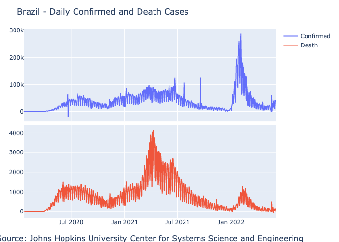

```{r, include = FALSE}
options(width = 1000)
knitr::opts_chunk$set(
  echo = FALSE,
  collapse = TRUE,
  message=FALSE, 
  warning=FALSE,
  cache = TRUE,
  comment = "")

library(JuliaConnectoR)
```


The [coronavirus](https://github.com/RamiKrispin/coronavirus) R package provides a tidy format dataset of the 2019 Novel Coronavirus COVID-19 (2019-nCoV) epidemic and the vaccination efforts by country. The data is refreshed on a daily basis and stored as an R data object. In addition, the data is available in a CSV format to enable none R users to pull and use it seamlessly.

The goal of this vignette is to demonstrate how to load the data into Julia. In the following example, we will load the `coronavirus` dataset, a tidy format of the John Hopkins COVID19 dataset, providing a daily summary of the COVID19 cases by type (confirmed, recovered, death), and by country.

The Julia source code can be find [here](https://github.com/RamiKrispin/coronavirus/blob/master/vignettes/using_julia.jl).

### Required Julia libraries

For loading the data from the `coronavirus` Github repository, summarized and plot it we will use the following libraries:

* **HTTP** - to load the data from url
* **CSV** - to read the CSV file
* **DataFrames** - to store the data as dataframe and manipulate it (filter, group by, etc.)
* **PlotlyJS** - to visualize the data
  
``` julia
using Pkg, CSV, DataFrames, PlotlyJS
```

```{r message=FALSE, warning=FALSE}
juliaEval('using Pkg
          Pkg.activate("covid19_env")
          Pkg.add(PackageSpec(name = "PlotlyJS", version = "0.18.8"))
          Pkg.add(PackageSpec(name = "CSV", version = "0.9.6"))
          Pkg.add(PackageSpec(name = "Chain", version = "0.4.8"))
          Pkg.add(PackageSpec(name = "DataFrames", version = "1.2.2"))
          using  CSV, DataFrames, Chain, PlotlyJS')
```

We will use the following packages versions:


``` julia
Pkg.status()
```

```{r }
juliaEval("Pkg.status()")
```

### Loading the data

We will start by loading the CSV file from the repository. Since we are pulling the CSV file from the web, as opposed to loading locally, we will have to use the `download` function to download the file and then read it as CSV file:
``` julia
url = "https://raw.githubusercontent.com/RamiKrispin/coronavirus/master/csv/coronavirus.csv"

# loading the data
file = CSV.File(download(url), missingstring= "NA")
```


```{r}
juliaEval('url = "https://raw.githubusercontent.com/RamiKrispin/coronavirus/master/csv/coronavirus.csv"
          file = CSV.File(download(url), missingstring= "NA")')
```

**Note:** similarly, you can load the vaccine data by using the following end point:
`https://raw.githubusercontent.com/RamiKrispin/coronavirus/master/csv/covid19_vaccine.csv`


Next, we will store the csv file as a `DataFrame` object:   

``` julia
df = DataFrame(file)

df
```
          

```{r}
juliaEval('df = DataFrame(file)
          df
          ')
```

We will use the `describe` function to review the dataframe attributes:

``` julia
describe(df) 
```
          

```{r}
juliaEval('describe(df)')
```


The dataset has the following fields:

* `date` - The date of the summary
* `province` - The province or state, when applicable
* `country` - The country or region name
* `Lat` - Latitude point
* `Long` - Longitude point
* `type` - The type of case (i.e., confirmed, death)
* `cases` - The number of daily cases (corresponding to the case type)
* `uid` - Country code
* `iso2` - Officially assigned country code identifiers with two-letter
* `iso3` - Officially assigned country code identifiers with three-letter
* `code3` - UN country code
* `combined_key` - Country and province (if applicable)
* `population` - Country or province population
* `continent_name` - Continent name
* `continent_code` - Continent code


### Data summary

Once we load the data, it would be interesting to explore the data using summary tables. In the following examples, we will create a summary of cases (confirmed and death) by country. We will use the `chain` function to filter the case type, group by country, aggregated by cases, and sort by the number of cases. We will start with a confirmed cases summary:

``` julia
@chain df begin
    filter(:type => ==("confirmed"),_)
    groupby([:combined_key, :type])
    combine([:cases] .=> sum)
    sort!([:cases_sum], rev = true)
end
```

```{r}
juliaEval('@chain df begin
    filter(:type => ==("confirmed"),_)
    groupby([:combined_key, :type])
    combine([:cases] .=> sum)
    sort([:cases_sum], rev = true)
end')
```


Similarly, we can summarize the total number of death cases by country:

``` julia
@chain df begin
    filter(:type => ==("death"),_)
    groupby([:combined_key, :type])
    combine([:cases] .=> sum)
    sort!([:cases_sum], rev = true)
end
```

```{r}
juliaEval('@chain df begin
    filter(:type => ==("death"),_)
    groupby([:combined_key, :type])
    combine([:cases] .=> sum)
    sort!([:cases_sum], rev = true)
end')
```


### Visualize the data

Last but not least, we will plot the data using [PlotlyJS](https://plotly.com/julia/), Plotly version for Julia. In the following example, we will generate a side-by-side plot of Brazil's total daily confirmed and death cases. We will start by filtering the cases in Brazil by case type - `confirmed` and `death`:

``` julia
df_brazil_confirmed = filter(row -> row.country == "Brazil" && row.type == "confirmed", df)
df_brazil_death = filter(row -> row.country == "Brazil" && row.type == "death", df)

```

```{r }
juliaEval('df_brazil_confirmed = filter(row -> row.country == "Brazil" && row.type == "confirmed", df)
df_brazil_death = filter(row -> row.country == "Brazil" && row.type == "death", df)
')
```


To plot the `confirmed` and `death` cases side by side, we will use the `make_subplots` function to set the grid and add the plots with the `add_trach` function:

``` julia
p = make_subplots(rows=2, 
                  cols=1, 
                  shared_xaxes=true, 
                  x_title = "Source: Johns Hopkins University Center for Systems Science and Engineering",
                  vertical_spacing=0.02)

add_trace!(p, scatter(df_brazil_confirmed,x=:date, y=:cases, name = "Confirmed"), row=1, col=1)
add_trace!(p, scatter(df_brazil_death,x=:date, y=:cases, name = "Death"), row=2, col=1)

relayout!(p, title_text="Brazil - Daily Confirmed and Death Cases")
p
```


```{r echo=FALSE, results= "hide"}
juliaEval('p = make_subplots(rows=2, 
                  cols=1, 
                  shared_xaxes=true, 
                  x_title = "Source: Johns Hopkins University Center for Systems Science and Engineering",
                  vertical_spacing=0.02)

add_trace!(p, scatter(df_brazil_confirmed,x=:date, y=:cases, name = "Confirmed"), row=1, col=1)
add_trace!(p, scatter(df_brazil_death,x=:date, y=:cases, name = "Death"), row=2, col=1)

relayout!(p, title_text="Brazil - Daily Confirmed and Death Cases")
savefig(p, "brazil.png")')
```


</a>


**Note:** The current markdown format does not support interactive HTML objects. Therefore, the plot out above was saved as a png file and lost its interactivity attributes.
